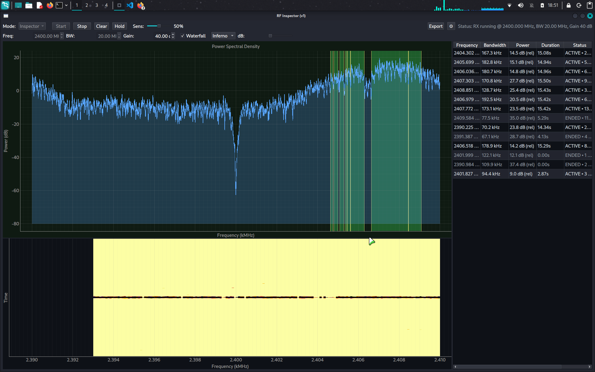
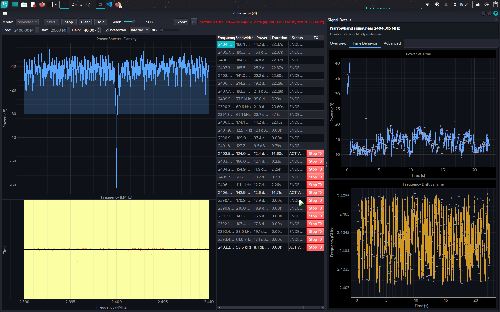
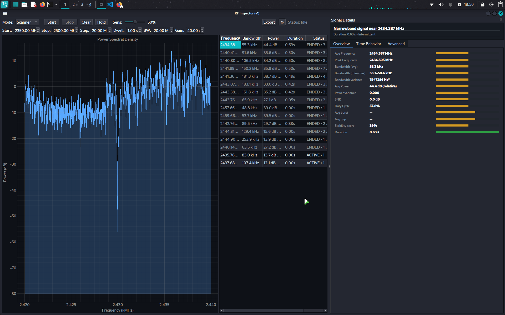

# RFwatch

RF signal detection and analysis system.

[](https://opensource.org/licenses/MIT)

RFwatch is a desktop application for detecting, analyzing, and visualizing radio-frequency (RF) signals in real time. It is designed to work with Software Defined Radio (SDR) hardware (currently HackRF One) and provides both focused single-band inspection and wideband scanning capabilities.

The tool emphasizes physical-layer signal understanding rather than protocol decoding or modulation guessing.

---

## Screenshots

Below are a few UI screenshots to give a quick feel for the workflow and capabilities.


Inspector mode: live spectrum view with controls for tuning and inspecting a single band in real time.


Signal details: event-centric view showing the measured characteristics of a detected signal over time.


Scanner mode: sweep across a frequency range and summarize activity as detected events.


Inspector TX: transmit test signals (Noise + Tone) at a chosen frequency for validation and experiments (HackRF required).


Scan Results TX: quickly transmit at a detected frequency directly from the scan results table.

---

## Core Philosophy & Vision

RFwatch is built around a few deliberate principles that guide both its architecture and feature set.

### Physical-Layer First

RFwatch operates strictly at the **physical layer**.  
It observes energy, bandwidth, time behavior, and stability — not packets, protocols, or modulation schemes.

If something cannot be supported directly by the RF data and hardware limits, RFwatch does not guess.

### Events, Not Guesswork

Instead of forcing users to interpret raw waterfalls and instantaneous spectra, RFwatch treats RF activity as **events**:

- When a signal appears
- How long it persists
- How wide it is
- How stable or bursty it behaves over time

This event-centric model allows the system to summarize RF behavior honestly and consistently.

### Honest Constraints

RFwatch does not attempt to hide or "work around" hardware limitations.

For example:
- HackRF's instantaneous bandwidth is respected
- Wideband monitoring is implemented via time-sliced scanning, not false continuity
- Power measurements are relative, not calibrated

The goal is **clarity**, not illusion.

### Deterministic, Explainable Analysis

All analysis in RFwatch is deterministic and explainable:
- No machine learning
- No black-box classification
- No protocol inference

Every displayed value can be traced back to observable RF behavior.

### Long-Term Vision

RFwatch aims to become a **reliable RF inspection and monitoring foundation**, suitable for:
- RF exploration and learning
- Research and experimentation
- Security and spectrum monitoring
- Building higher-level RF tooling

Future versions may add deeper analysis layers, but never at the cost of transparency or trust.

---

## Features

-   **Real-time Spectrum Analysis**: Visualize RF spectrum in real-time.
-   **Signal Detection**: Automated detection of signals based on power and SNR.
-   **Event Tracking**: Tracks signal events over time, recording start/end times and characteristics.
-   **Transmission**: Capable of transmitting test signals (Noise + Tone) at user-defined frequencies (requires HackRF).
-   **Dual Modes**:
    -   **Inspector Mode**: Continuous monitoring of a single frequency.
    -   **Scanner Mode**: Sweeps across a user-defined frequency range.
-   **Hardware Support**: Integrated with HackRF via GNU Radio.
-   **Modular Architecture**: Clean separation between UI, Core Engine, and Hardware abstraction.

## Project Structure

```
rfwatch/
├── core/           # Core detection engine (the brain)
├── grblocks/       # GNU Radio integration blocks
├── ui/             # User interface (PySide6/PyQt)
├── utils/          # Shared DSP and utility functions
├── cli/            # Command-line interface
└── tests/          # Unit tests
```

## Core Modules

-   **config.py**: Single source of truth for all configuration parameters.
-   **event.py**: Signal event object definition.
-   **iq_stream.py**: Thread-safe IQ sample buffer.
-   **detector.py**: Binary signal detection (power + SNR estimation).
-   **segmenter.py**: Frequency and time segmentation.
-   **event_store.py**: Central thread-safe event storage.
-   **feature_extractor.py**: Feature extraction from completed events.

## Architecture

### Four-Layer Design

```
┌─────────────────────────────────────────┐
│  UI (Control Panel + Display)           │
│  - Mode selector (Inspector/Scanner)    │
│  - Frequency inputs                     │
│  - Start/Stop buttons                   │
│  - Live spectrum display                │
│  - Progress bar (scanner mode)          │
└─────────────────┬───────────────────────┘
                  │
┌─────────────────▼───────────────────────┐
│  EngineController (Mode Management)     │
│  - Owns Inspector & Scanner modes       │
│  - Manages start/stop lifecycle         │
│  - Handles hardware retuning            │
│  - Controls scan loops                  │
└─────────────────┬───────────────────────┘
                  │
┌─────────────────▼───────────────────────┐
│  Engine (RF Analysis - Pure Pipeline)   │
│  - Detector (binary detection)          │
│  - Segmenter (frequency analysis)       │
│  - EventBuilder (time aggregation)      │
│  - FeatureExtractor (on event close)    │
└─────────────────┬───────────────────────┘
                  │
┌─────────────────▼───────────────────────┐
│  IQ Source (Hardware)                   │
│  - HackRF (live RF data)                │
└─────────────────────────────────────────┘
```

### Core Principle
**UI never runs loops, never retunes hardware, never decides "what happens next".**
The Engine Controller owns modes and execution. UI is just a control panel.

## Installation

### Prerequisites
-   Linux (Recommended)
-   Python 3.8+
-   GNU Radio 3.8+ (with Python bindings)
-   HackRF tools and libraries (`libhackrf`, `gr-osmosdr`)

### System Dependencies (Debian/Ubuntu/Kali)

```bash
sudo apt install gnuradio gr-osmosdr hackrf \
  python3-pyside6.qtcore python3-pyside6.qtwidgets \
  python3-pyside6.qtgui python3-pyside6.qtopengl
```

### Setup

1.  **Clone the repository:**
    ```bash
    git clone https://github.com/thecipher24/RFwatch.git
    cd RFwatch
    ```

2.  **Install Python dependencies:**
    ```bash
    pip install -r requirements.txt
    ```

3.  **Verify HackRF (optional):**
    ```bash
    hackrf_info
    ```

## Usage

### GUI (Recommended)

```bash
python -m ui.app
```

#### Environment Variables

| Variable | Purpose |
|---|---|
| `RFWATCH_FORCE_HACKRF=1` | Skip HackRF safety checks (use if you're sure the hardware is connected) |
| `RFWATCH_HACKRF_ARGS` | Override HackRF source arguments (default: `numchan=1 hackrf=0`) |
| `RFWATCH_HACKRF_BIAS_T=1` | Enable HackRF bias tee (antenna power) |
| `RFWATCH_DEBUG=1` | Enable debug logging |
| `RFWATCH_DEBUG_DETECTOR=1` | Enable detector debug output |
| `RFWATCH_UI_PSD_INTERVAL_S=0.1` | PSD snapshot interval (seconds) |

#### Transmission Features
1.  **Enable Transmission**: Go to Settings (gear icon) and check "Enable Transmission".
2.  **Manual Transmission**: Use the "TX" controls in Inspector or Scanner mode.
3.  **Quick Action**: In the Scan Results table, use the "TX" button.

### CLI

```bash
python cli/run.py --duration 10 --freq 100e6 --sample-rate 2e6 --gain 40
```

## Testing

```bash
python -m pytest tests/ -v
```

## Troubleshooting

-   **HackRF not found**: Ensure your user has permission to access USB devices.
    ```bash
    sudo apt install hackrf
    lsusb | grep HackRF
    ```
-   **GNU Radio Import Errors**: Install system packages (`gnuradio`, `gr-osmosdr`). Do not use pip for these.

## Project Status

RFwatch is currently in **early-stage development**.

The core architecture and feature set are stable, but the project is expected to evolve as new capabilities and refinements are added. The current release focuses on correctness, transparency, and physical-layer accuracy rather than breadth of features.

## License

This project is licensed under the MIT License - see the [LICENSE](LICENSE) file for details.

## Author

RFwatch is created and maintained by **Pranav Dhiran**.

This project originated as an effort to build an honest, event-centric RF inspection tool that respects physical-layer constraints and avoids protocol-level guessing.
